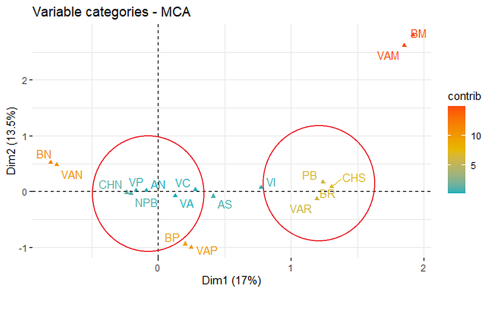
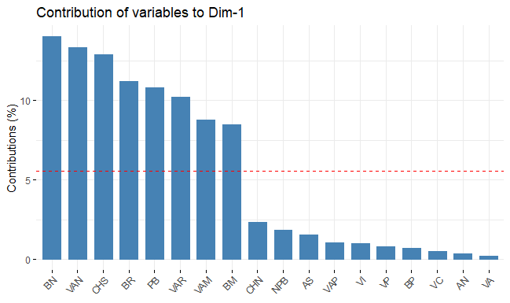

# Segmentación del mercado

## Uso del análisis de correspondencias múltiples con R


# Definir el directorio de trabajo y cargar los datos
```
setwd("directory")
data <- read.table("data.txt", header = TRUE) 
```
# Asignar etiquetas cortas a las categorías de las variables
```
data$p3 <- factor(data$p3,  levels = c(1,2,3,4),
labels = c("BM","BR","BP","BN"))

data$p4 <- factor(data$p4,  levels = c(1,2,3,4),
labels = c("VAM","VAR","VAP","VAN"))

data$tenencia <- factor(data$tenencia,  levels = c(1,2,3,4),
labels = c("VP","VA","VC","VI"))

data$allega_int <- factor(data$allega_int,  levels = c(1,2),
labels = c("AN","AS"))

data$hh_d_habitab <- factor(data$hh_d_habitab,  levels = c(1,2),
labels = c("CHN","CHS"))

data$pobreza5d <- factor(data$pobreza5d,  levels = c(1,2),
labels = c("NPB","PB"))
```
# ANÁLISIS

# Se incluirán todas las variables del conjunto de datos

# Cargar las bibliotecas
```
library(FactoMineR)
library(ggplot2)

# install.packages("devtools")

library("devtools")
install_github("kassambara/factoextra")

# Cargar factoextra

library("factoextra")
```
# Ajustar el modelo de Correspondencias Múltiples (MCA) a los datos
```
res.mca <- MCA(data, graph=FALSE)
```
# Graficar los resultados del Análisis de Correspondencias Múltiples (MCA)
```
fviz_mca_var(res.mca, repel = TRUE, col.var = "contrib",
  gradient.cols = c("#00AFBB", "#E7B800", "#FC4E07"))
```


El gráfico muestra dos grupos formados a partir de la asociación de las categorías de las variables independientes a las categorías “POBRE” y “NO POBRE” de la variable dependiente "NIVEL SOCIOECONÓMICO".

PB	:	HOGAR POBRE

  BR	:	En el entorno o barrio se observa cierta cantidad de basura

  CHS	:	La vivienda presenta carencias en habitabilidad

  VAR	:	En el entorno o barrio existe cierto nivel de vandalismo
  
NPB	:	HOGAR NO POBRE

  VAN	:	En el entorno o barrio no existe vandalismo

  VP	:	vivienda propia

  CHN	:	La vivienda no presenta carencias en habitabilidad

  VC	:	Tenencia de vivienda: cedida

  VA	:	Tenencia de vivienda: arrendada

# Visualizar las contribuciones de las categorías de las variables al eje 1
```
fviz_contrib(res.mca, choice ="var", axes = 1)
```


